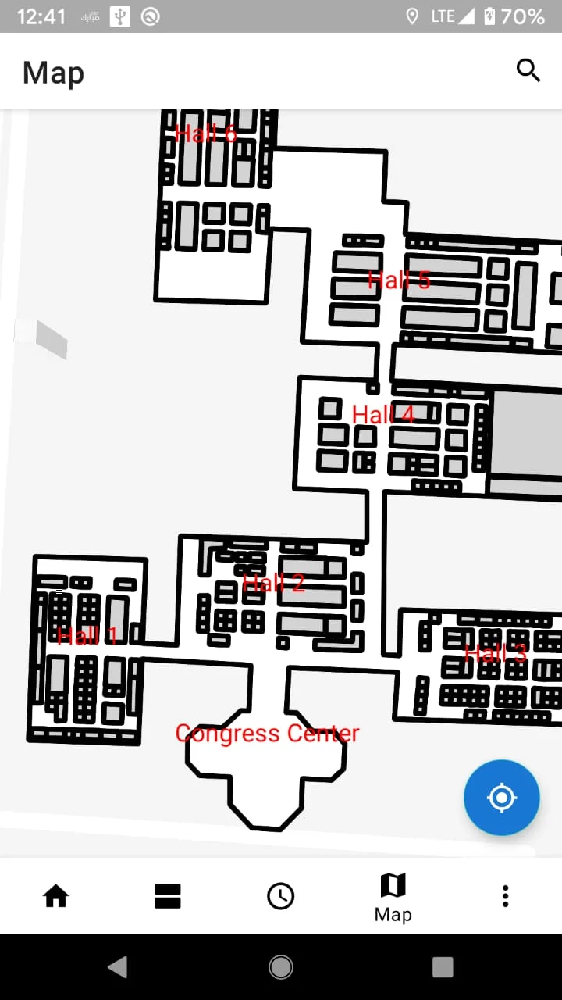
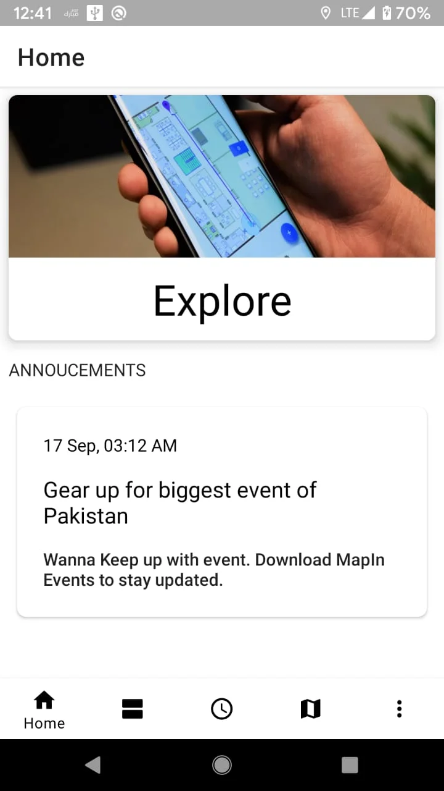
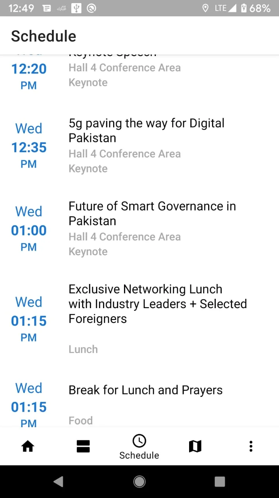
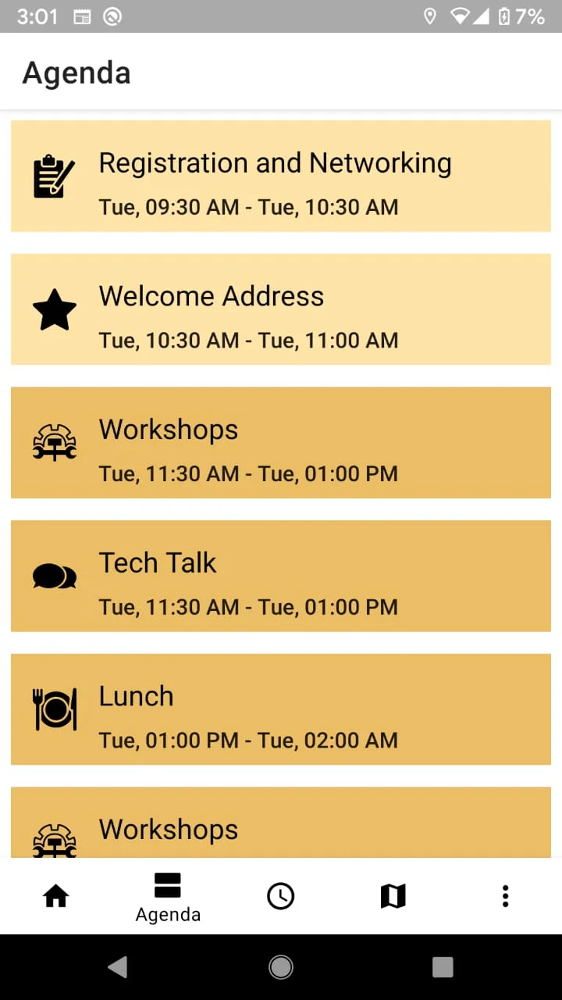
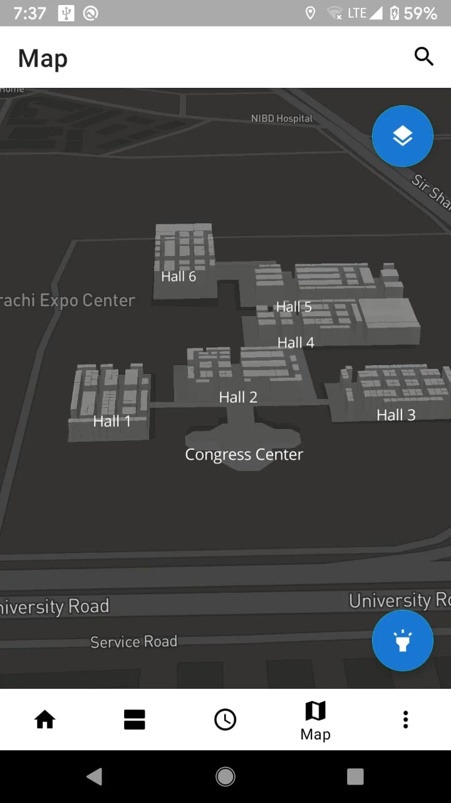
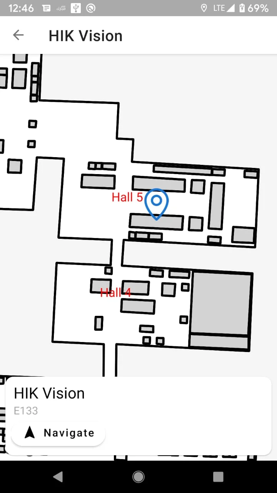

# MapIn Events

Inspired by Google I/O, 2019 application.

This application uses modern architecture components architecture as suggested by Android Docs. The application was developed in partnership with the event organiser at one the largest IT event of Pakistan. The application served as personal event assitant for the event visitors having the following features:
1. Real Time Notifications
2. Agenda
3. Schedule
4. Indoor Maps
5. Stalls Navigation
6. Stalls Searchability

##### Notes
The application requires tweakings before running.

##### Screenshots

##### Extras 
The application is not actively maintained. 

##### License

